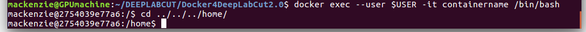
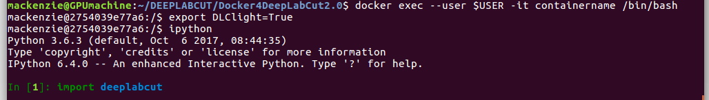
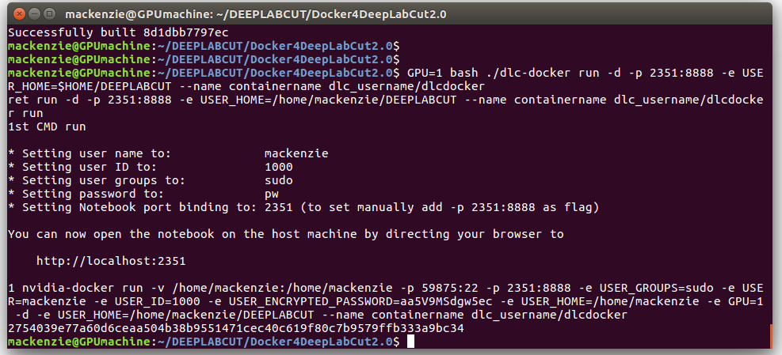

# Docker Environment for DeepLabCut2.0

This package will allow you to run [DeepLabCut](https://github.com/AlexEMG/DeepLabCut) with everything pre-installed inside a Docker container. To note, the GUIs will not work in Docker, so we recommend you use them in an Anaconda Environment (see main repo for installation instructions). The use-case for the Docker is for the steps that requite a GPU, namely training and inference (i.e. video analysis). This can be done inside this container on your computer, or deployed to a cloud!

This Docker file is based off the [Bethge lab container](https://github.com/bethgelab/docker). Specifically, the one we provide comes with **Ubuntu 16.04 + CUDA 9.0 + CuDNN v7** and **Tensorflow 1.8** and the required python packages. 

Note, please check your NVIDIA driver is up to date (for CUDA9 you need > 384.xx).  Please check your driver/CUDA/TensorFlow version on [this Stackoverflow post](https://stackoverflow.com/questions/30820513/what-is-the-correct-version-of-cuda-for-my-nvidia-driver/30820690#30820690).


NOTE: [this container does not work on windows hosts!](https://github.com/NVIDIA/nvidia-docker/issues/43)

## Prerequisites

**(1)** Install Docker. See https://docs.docker.com/install/ & for Ubuntu: https://docs.docker.com/install/linux/docker-ce/ubuntu/
Test docker: 

    $ sudo docker run hello-world
    
 The output should be: ``Hello from Docker! This message shows that your installation appears to be working correctly.``

**(2)** Install nvidia-docker (version 1 only), see https://github.com/nvidia/nvidia-docker/wiki/Installation-(version-1.0). Specifically for linux follow, https://nvidia.github.io/nvidia-docker/.
But, basically it is just: 

    $ sudo apt-get install nvidia-docker
    
**(3)** Add your user to the docker group (https://docs.docker.com/install/linux/linux-postinstall/#manage-docker-as-a-non-root-user)
Quick guide  to create the docker group and add your user: 
Create the docker group.

    $ sudo groupadd docker
Add your user to the docker group.

    $ sudo usermod -aG docker $USER

(perhaps restart or (at min) open a new terminal to make sure that you are added from now on)
Lastly, download this Docker: 
```
git clone https://github.com/MMathisLab/Docker4DeepLabCut2.0
cd Docker4DeepLabCut2.0
```

## Step-by-step instructions for creating the Docker environment:

Next create the image. The image needs only be created **once**. All the required software will be downloaded from DockerHub. (you can pick a user name and container name other than dlc_username/dlcdocker if you want):
```
docker image build -t dlc_username/dlcdocker .
```

## Starting the docker container from your image (de-novo):

In the terminal start your container with the following command (in the DockerContainer4DeepLabCut2.0 folder):

Options: 
- change port: (i.e. ``2351`` can be ``777``, etc)
- change which GPU to use (check which GPU you want to use in the terminal by running ``nvidia-smi``)
- change the name: --name ``containername``  can be anything you want
- change the home fodler:``-e USER_HOME=$HOME/DeepLabCut``  (i.e. this can be ``-e USER_HOME=$HOME/whateveryouwant``)

```
GPU=1 bash ./dlc-docker run -d -p 2351:8888 -e USER_HOME=$HOME/DeepLabCut --name containername dlc_username/dlcdocker
```
Do not run this with sudo. 

## Using the Docker for Training and Video Analysis:

 - Enter the container via the terminal (to get terminal access in container):
```
docker exec --user $USER -it containername /bin/bash
```
Access your linked (internal home) directory:
```
cd ../../../home/
```  
<p align="center">

</p>

Now, for the training and video analysis you need to supress the GUI support: 

``Linux: export DLClight=True``

<p align="center">

</p>

Now you have an Ubuntu with **Python3** and a GPU-installed with **Tensorflow 1.8**, and all the other dependencies ... installed! Happy DeepLabCutting! 

## Jupyter + Docker:

This container could also be used for other things besides DeepLabCut, so you might want to utlitize the features in Jupyter, i.e. you can also go into the terminal separately via a browser interface (i.e Google Chrome + a Jupyter Notebook) to check out what's inside. For this, go to the port you specified, i.e. in our example enter http://localhost:2351 in Google Chrome.
Get the token for entry: back in the terminal, look at the docker log; copy and paste the value after "token=":

    $ docker logs containername 
   
<p align="center">

</p>
  
Then, you can open the notebook provided, to [check your installation](/checkTFversion_and_GPU.ipynb) and play around with other ways this Docker could be useful to you. 

# Docker Quick Tips:
Check which containers are running:

    $ docker ps 
You can stop a container: 

    $ docker stop containername 

You can re-start your container:

    $ docker start containername

After stopping you can remove old containers: 

    $ docker rm containername

(once removed, it can be created again): 
```
GPU=1 bash ./dlc-docker run -d -p 2351:8888 -e USER_HOME=$HOME/DeepLabCut --name containername dlc_username/dlcdocker
```
